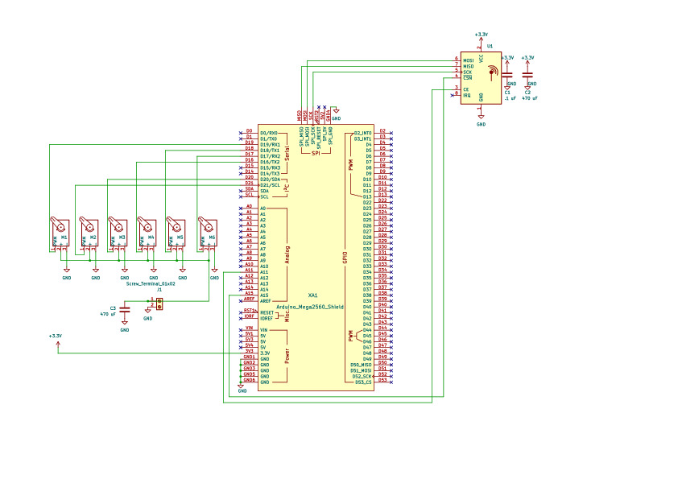

### nRF_Servo_Mega

[PDF schematic](documentation/nRF_servo_Mega_schematic.pdf)

This shield 
is mean to sit on a Mega (which means using the SPI pins on the ICSP header)
with the Adafruit Music Maker Shield.

Pin usage:

SPI on Mega (used by both Music Maker Shield and nRF radio)
| Arduino Pin |
| --- |
| 51 |
| 52 |
| 53 |

Music Maker Shield

| SPI Signal Name | Description | Arduino Pin |
| --- | --- | --- |
| MCS | VS1053 chip select pin | 7 |
| DCS | VS1053 data select pin | 6 |
| CCS | SD Card chip select pin | 4 |
| DREQ | VS1053 data request interrupt pin | 3 |

#### Revisions

Rev 0.1
- Replace motor numbers with pin numbers
- Improve marking of servo pin assignments
- Add voltage and polarity to screw terminals

#### Revisions
Rev 0.2
- Fix servo motor pin assignments
- Add text indicating servo pin assignment
- Improve visibility of voltage and polarity to screw terminals

#### Suggestions for future
- Extend board past the 36 pin connector and add more servo motor connectors?
- Enlarge text of voltage and polarity to screw terminals

#### Assembly instructions
##### Assembly order
1. .1 ufd cap
1. nRF socket
1. servo pins
1. Stacking headers
1. Screw terminal
1. ICSP header
1. 470 uFD caps

(Note that the order of the instructions and video below are slightly
different - I don't think it makes much of a difference.)

##### Assembly instructions
nRF Servo Mega Shield [video](https://youtu.be/EMkqwKK7xOQ)

1. Install the .1 uFD capacitor in position C1. This is the tiny brown disk
   that says "104" on it. This component is NOT polarized. Solder.
   Cut the excess leads right down to the solder. Discard the cut of portion
   so that it doesn't cause a short circuit
2. Cut two pieces of header sockets each with 4 positions. They need to be
   held together so use a piece of header pins across them to hold them
   together. Solder one pin, and then reheat the pin while you straighten out
   the connector. Solder the rest of the pins.
1. Prepare 6 sets of header pins, each with 3 positions. Insert into positions
   M1 - M6 and D20 (my mistake in labeling). Solder one pin, straighten, and
   then solder the rest of the pins. You may find it easier to do one header
   at a time instead of trying to do all 6 at once like I did.
1. From the bag of feed-through headers, remove six 5 position headers and one
   10 position header. Return the rest to the bag.
    Solder one pin, straighten, then solder the rest. It is very important to
    get these to line up properly so don't solder the rest of the pins until
    the header is straight.
1. Install the feed through header that is two rows of 3 pins. **Note that
   this goes in the opposite direction i.e. the pins face up and the socket
   faces down**. Solder and straighten.
1. Install the two 470 uFD electrolytic capacitors. 
    Note that these components **are polarized** so you have to install them in
    the right direction. The grey stripe must go into the hole with the white
    semicircle.
   Cut the excess leads right down to the solder. Discard the cut of portion
   so that it doesn't cause a short circuit
1. Install the screw terminal. Make sure that the openings face the edge of
   the board. Solder. These pins are quite thick and the hole is quite big, so
   keep feeding solder until the hole fills up.
