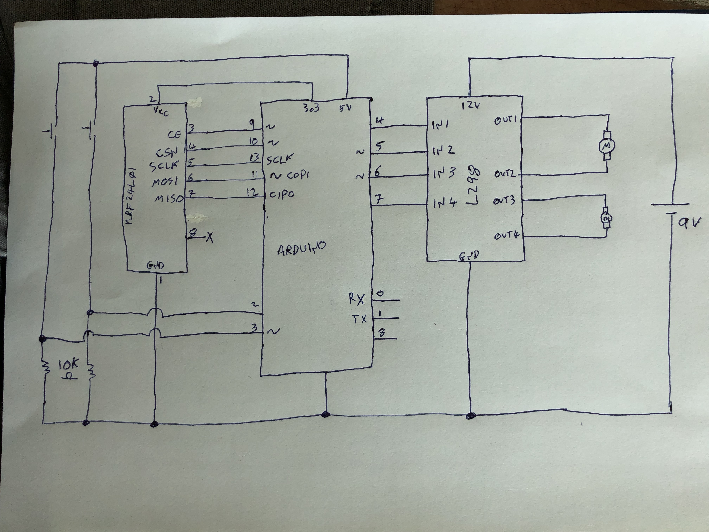
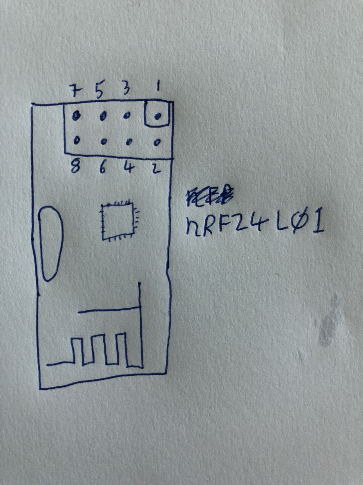

# Sample code and circuit using the nRF24L01 with Arduino

rfXmit and rfRcvr are the most simple examples, sending a single integer 

rf24XmitTwoBytes and rfRcvrTwoBytes separate the integer into two bytes, the
lower byte
is treated as a bit map (one bit per switch) while the upper byte is numeric
and in this example is assumed to request different displays on a NeoPixel
matrix

The schematic below shows both the transmitter and receiver circuit; the
transmitter would use the switches, while the receiver would use the motor
driver and motors.

Pin numbers for the nRF24L01 module:

