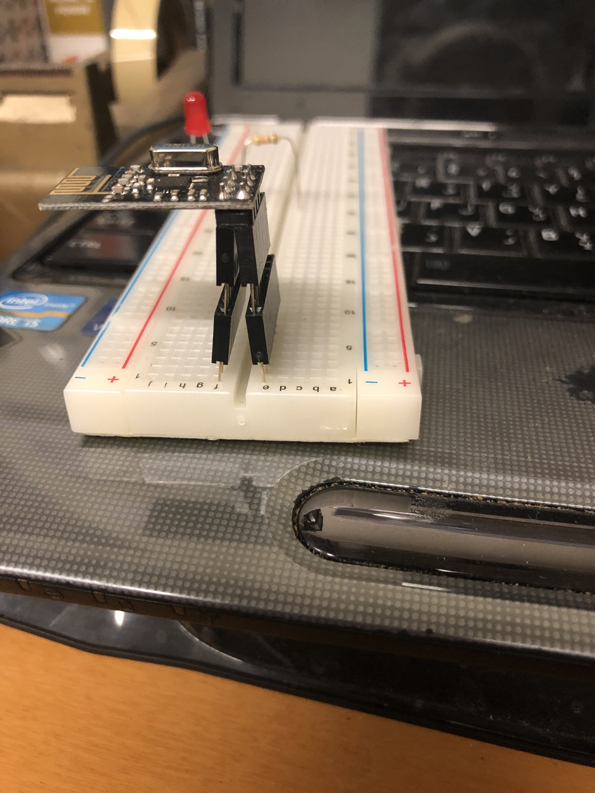

# Sample code and circuit using the nRF24L01 with Arduino

rfXmit and rfRcvr are the most simple examples, sending a single integer 

rf24XmitTwoBytes and rfRcvrTwoBytes separate the integer into two bytes, the
lower byte
is treated as a bit map (one bit per switch) while the upper byte is numeric
and in this example is assumed to request different displays on a NeoPixel
matrix

The schematic below shows both the transmitter and receiver circuit; the
transmitter would use the switches, while the receiver would use the motor
driver and motors.

Pin numbers for the nRF24L01 module:

To prototype with the radio module on a solderless breadboard, you can use
feed through headers:

# Possible problems and solutions
[This](https://www.mysensors.org/build/connect_radio) suggests that receiving
is more sensitive to noise than transmitting

[This](https://www.reddit.com/r/arduino/comments/b0n9qs/external_power_supply_needed_with_nrf24l01/) claims that "anything that can go wrong with nrf24l01+s is down to
the power supply"

Useful [thread](https://forum.arduino.cc/t/500mw-nrf24l01-question/1294520)
on the Arduino forum
with some answers from TMRh20, author of the library, with a discussion about
power supply isues

Another
[thread](https://forum.arduino.cc/t/need-help-getting-my-nrf24l01-module-to-work/1393212)
discussing power supply issues

Yet another
[thread](https://forum.arduino.cc/t/nrf24l01-tranciever-module-working-issue/1399377/4)
discussing power supply issues. See especially reply from gilshultz

[Common Issues](https://github.com/nRF24/RF24/blob/master/COMMON_ISSUES.md)
page for the RF24 library

# Other references
Great [technical
description](https://wolles-elektronikkiste.de/en/nrf24l01-2-4-ghz-radio-modules)
of the nRF24L01 modules

Great
[tutorial](https://howtomechatronics.com/tutorials/arduino/arduino-wireless-communication-nrf24l01-tutorial/)

# Projects not mine
[Hobby RC
transmitter](https://howtomechatronics.com/projects/diy-arduino-rc-transmitter/)

Another [hobby RC controller](https://electronoobs.com/eng_arduino_tut86.php)

As an alternative, [this](https://wolles-elektronikkiste.de/en/hc-12-radio-module) tutorial uses the HC-12 radio modules
